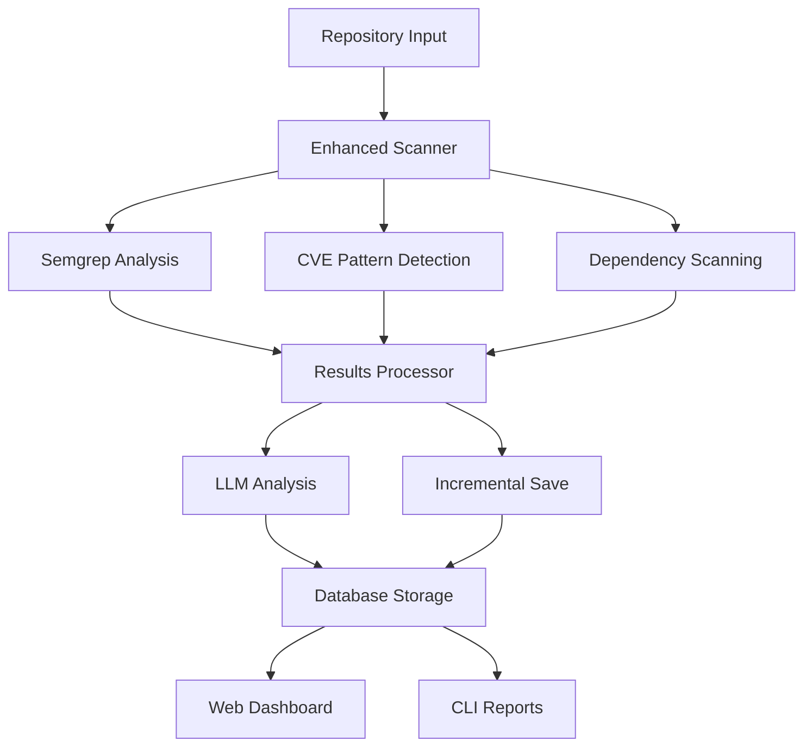

# QuAi Deep - Enhanced Malicious Code Detection & Vulnerability Assessment


## 🔒 Overview

QuAi Deep is a comprehensive security scanning solution that combines static code analysis, AI-powered vulnerability assessment, and automated remediation suggestions. This enhanced version addresses all the challenges from the original implementation and provides enterprise-grade features for modern development workflows.

### 🎯 Key Features

- **🔍 Comprehensive Scanning**: Static analysis with Semgrep, CVE pattern detection, and dependency vulnerability scanning
- **🤖 AI-Powered Analysis**: LLM integration for enhanced vulnerability assessment and remediation suggestions  
- **🏗️ Database Persistence**: SQLite database for historical scan tracking and comparison
- **⚡ Incremental Saving**: Prevents data loss during long scans or API failures
- **🎨 Modern Web UI**: Interactive dashboard with real-time progress tracking
- **📊 OWASP Top 10 Compliance**: Built-in mapping to OWASP security categories
- **🔄 Historical Analysis**: Compare scans over time and track improvements
- **🛠️ Flexible Scanning**: Support for specific paths, custom rules, and multiple scan types

## 🏗️ Architecture

```
QuAi Deep Enhanced Architecture
├── Core Engine
│   ├── Enhanced Semgrep Scanner (enhanced_scanner.py)
│   ├── CVE Pattern Scanner (cve_scanner.py)
│   ├── Dependency Scanner (cve_scanner.py)
│   └── Optimized LLM Analyzer (optimized_llm_analyzer.py)
├── Data Layer  
│   ├── SQLite Database (database.py)
│   └── Incremental Results Processor (enhanced_results_processor.py)
├── Web Interface
│   ├── Flask Application (enhanced_app.py)
│   └── Interactive Templates (templates/*.html)
└── CLI Interface
    └── Enhanced Main Application (enhanced_main.py)
```

## 🚀 Quick Start

### Prerequisites

- Python 3.8+
- Semgrep CLI tool
- Ollama with Qwen2.5-Coder model (for AI analysis)
- Git (for repository cloning)

### Installation

1. **Clone or extract the QuAi Deep files**

2. **Install Python dependencies:**
   ```bash
   pip install -r requirements.txt
   ```

3. **Install Semgrep:**
   ```bash
   pip install semgrep
   ```

4. **Install and setup Ollama with Qwen2.5-Coder:**
   ```bash
   # Install Ollama (visit https://ollama.ai for platform-specific instructions)
   ollama pull qwen2.5-coder:3b
   ollama serve  # Start the Ollama service
   ```

### Quick Scan

```bash
# Command line interface
python enhanced_main.py https://github.com/user/repo.git

# Web interface
python enhanced_app.py
# Then visit http://localhost:5000
```

## 📚 Usage Guide

### Command Line Interface

#### Basic Repository Scan
```bash
python enhanced_main.py https://github.com/user/vulnerable-app.git
```

#### Scan Specific Path
```bash
python enhanced_main.py /local/repo --path src/security/
```

#### Security-Focused Scan
```bash
python enhanced_main.py https://github.com/user/repo.git --scan-type security
```

#### View Recent Scans
```bash
python enhanced_main.py --list-scans
```

#### Get Scan Details
```bash
python enhanced_main.py --scan-id 123
```

#### Available Options
```bash
python enhanced_main.py --help
```

### Web Interface

1. **Start the web application:**
   ```bash
   python enhanced_app.py
   ```

2. **Access the dashboard:** http://localhost:5000

3. **Key Features:**
   - **Dashboard**: Overview of recent scans and statistics
   - **New Scan**: Configure and start scans with real-time progress
   - **Scan History**: Browse and filter historical scans  
   - **Compare Scans**: Side-by-side analysis of multiple scans
   - **OWASP Dashboard**: Compliance overview and categorization

## 🔧 Configuration

### Database Configuration

The system uses SQLite by default. To customize:

```python
# In database.py
db = ScanDatabase(db_path="custom_scan_results.db")
```

### LLM Configuration

Configure the AI analysis component:

```python
# In optimized_llm_analyzer.py
analyzer = OptimizedLLMAnalyzer(
    api_url="http://localhost:11434/api/generate",
    timeout=60,
    max_workers=3,
    enable_caching=True
)
```

### Semgrep Rules

Customize security rules:

```bash
# Use specific rulesets
python enhanced_main.py repo --custom-rules p/owasp-top-ten p/security-audit

# Available rulesets:
# - p/security-audit: General security rules
# - p/owasp-top-ten: OWASP Top 10 specific
# - p/cwe-top-25: CWE Top 25 dangerous software errors
# - p/r2c-security-audit: R2C security audit rules
```

## 📊 Scan Types

### 1. Comprehensive Scan (Default)
- Full Semgrep analysis with auto rules
- CVE pattern detection
- Dependency vulnerability scanning
- AI-powered risk assessment
- OWASP Top 10 mapping

### 2. Security-Focused Scan  
- Security-specific Semgrep rules only
- OWASP Top 10 and CWE Top 25 focus
- Faster execution
- Critical vulnerability prioritization

### 3. Focused Scan
- Quick scan for common vulnerabilities
- Limited rule set for speed
- Good for continuous integration

## 🛡️ Security Features

### Vulnerability Detection

- **Static Analysis**: 1000+ Semgrep security rules
- **CVE Patterns**: Common vulnerability patterns and signatures
- **Dependency Scanning**: Known vulnerable packages and versions
- **Custom Patterns**: Hardcoded secrets, crypto issues, injection flaws

### OWASP Top 10 Coverage

| OWASP Category | Detection Methods |
|----------------|------------------|
| A01: Broken Access Control | Path traversal, authorization bypass patterns |
| A02: Cryptographic Failures | Weak crypto algorithms, hardcoded keys |
| A03: Injection | SQL injection, XSS, command injection |
| A04: Insecure Design | Design pattern analysis |
| A05: Security Misconfiguration | Configuration file analysis |
| A06: Vulnerable Components | Dependency vulnerability scanning |
| A07: Authentication Failures | Authentication bypass patterns |
| A08: Data Integrity Failures | Deserialization vulnerabilities |
| A09: Logging Failures | Insufficient logging detection |
| A10: Server-Side Request Forgery | SSRF pattern detection |

### Risk Assessment

The system provides 4-tier risk classification:

- **CRITICAL**: Immediate security threat, requires urgent attention
- **HIGH**: Significant security risk, should be addressed quickly  
- **MEDIUM**: Moderate security concern, plan remediation
- **LOW**: Minor security issue, address during regular maintenance

## 🔄 Data Flow



## 🔍 Advanced Features

### Incremental Result Saving

Prevents data loss during long scans:
- Results saved after each finding analysis
- Automatic recovery from interruptions
- JSONL format for streaming compatibility

### Parallel Processing

Optimized for performance:
- Multi-threaded LLM analysis
- Concurrent CVE and dependency scanning
- Rate-limited API calls

### Caching System

Reduces redundant processing:
- LLM response caching
- CVE pattern caching
- Configurable cache persistence

### Historical Comparison

Track security improvements over time:
- Scan-to-scan comparison
- Trend analysis
- Regression detection

## 📈 Performance

### Typical Scan Times

| Repository Size | Comprehensive | Security-Focused | Focused |
|----------------|---------------|------------------|---------|
| Small (<1K files) | 5-10 minutes | 3-7 minutes | 1-3 minutes |
| Medium (1K-5K files) | 10-25 minutes | 7-15 minutes | 3-8 minutes |
| Large (>5K files) | 25-60 minutes | 15-30 minutes | 8-20 minutes |

### Optimization Tips

1. **Use Specific Paths**: Scan only relevant directories
2. **Choose Appropriate Scan Type**: Use focused scans for CI/CD
3. **Configure LLM Workers**: Adjust parallel processing based on hardware
4. **Enable Caching**: Reuse LLM analysis for similar findings

## 🐛 Troubleshooting

### Common Issues

#### 1. LLM Service Not Available
```bash
# Check Ollama service
ollama list
ollama serve

# Verify model availability  
ollama show qwen2.5-coder:3b
```

#### 2. Semgrep Not Found
```bash
# Install semgrep
pip install semgrep

# Verify installation
semgrep --version
```

#### 3. Database Lock Errors
```bash
# Check for existing processes
ps aux | grep python

# Remove lock if safe
rm scan_results.db-wal scan_results.db-shm
```

#### 4. High Memory Usage
- Reduce LLM max_workers in configuration
- Use focused scan type for large repositories
- Scan specific paths instead of entire repository

### Log Analysis

Enable verbose logging:
```python
import logging
logging.basicConfig(level=logging.DEBUG)
```

## 🔒 Security Considerations

### Data Privacy
- Scans are performed locally
- No code is sent to external services (except configured LLM endpoint)
- Database contains code snippets - secure appropriately

### Network Security
- LLM API calls to localhost by default
- Configure firewall rules for custom endpoints
- Use HTTPS for remote LLM services

### Access Control
- Web interface has no built-in authentication
- Implement reverse proxy authentication if needed
- Restrict network access to web interface

## 🤝 Contributing

### Development Setup

1. **Fork the repository**
2. **Create development environment:**
   ```bash
   python -m venv quai-deep-dev
   source quai-deep-dev/bin/activate  # or venv\\Scripts\\activate on Windows
   pip install -r requirements.txt
   ```

3. **Run tests:**
   ```bash
   python -m pytest tests/
   ```

### Code Style

- Follow PEP 8 Python style guidelines
- Use type hints where appropriate
- Document all public functions and classes
- Add unit tests for new features

## 📋 Changelog

### Version 2.0 (Enhanced)

#### ✅ Resolved Original Issues
- **API Timeouts**: Implemented optimized LLM analyzer with retry logic and shorter prompts
- **Data Loss**: Added incremental saving with JSONL format to prevent loss during API failures
- **Basic UI**: Created comprehensive web interface with real-time progress and historical views
- **No Database**: Implemented SQLite database with full scan history and comparison features
- **CVE/OWASP Gap**: Added CVE pattern detection and comprehensive OWASP Top 10 mapping
- **Full Repo Only**: Added support for scanning specific paths within repositories

#### 🚀 New Features
- Real-time scan progress tracking
- Multi-threaded analysis processing
- Advanced filtering and search capabilities  
- OWASP compliance dashboard
- Historical scan comparison
- Automated remediation suggestions
- Export functionality for results
- Comprehensive CLI with multiple output formats

#### 🏗️ Technical Improvements
- Modular architecture with clear separation of concerns
- Optimized database schema with proper indexing
- Caching system for improved performance
- Rate limiting and timeout handling
- Error recovery and graceful degradation
- Comprehensive logging and monitoring

## 📞 Support

### Documentation
- **README.md**: This comprehensive guide
- **Code Comments**: Inline documentation in all modules
- **Example Usage**: See `examples/` directory (if created)

### Community
- **Issues**: Report bugs and request features via GitHub Issues
- **Discussions**: Join community discussions
- **Wiki**: Additional documentation and guides

### Professional Support
For enterprise deployments and custom integrations, contact the development team.

## 📄 License

This project is licensed under the MIT License - see the LICENSE file for details.

## 🙏 Acknowledgments

- **Semgrep**: For the excellent static analysis engine
- **Ollama**: For local LLM serving capabilities  
- **Qwen2.5-Coder**: For the powerful code analysis model
- **OWASP**: For security guidance and categorization
- **Bootstrap**: For the responsive web interface components

---

**QuAi Deep Enhanced** - Comprehensive Security Scanning for Modern Applications

*Secure your code, protect your applications, enable your developers.*